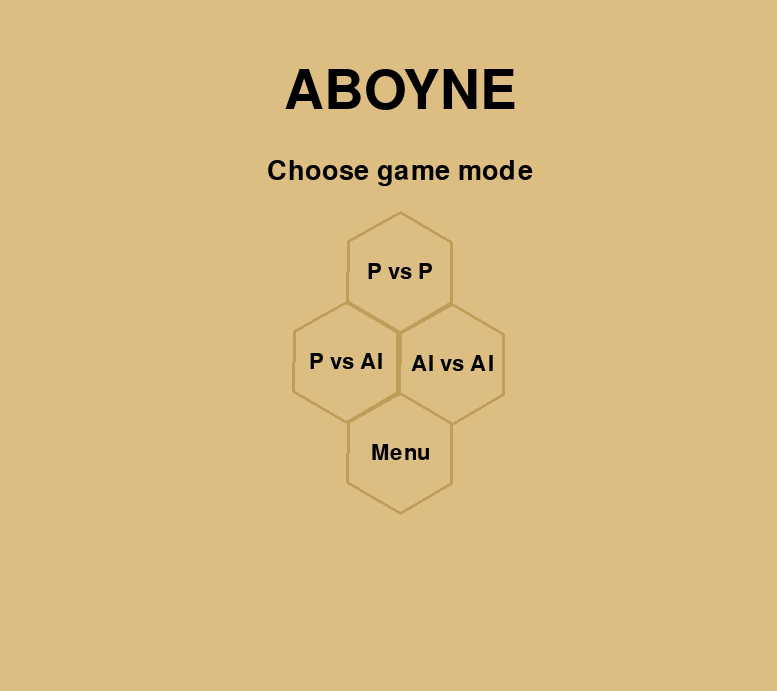
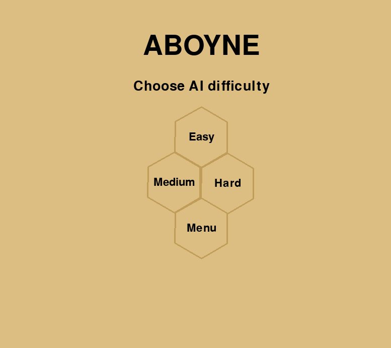
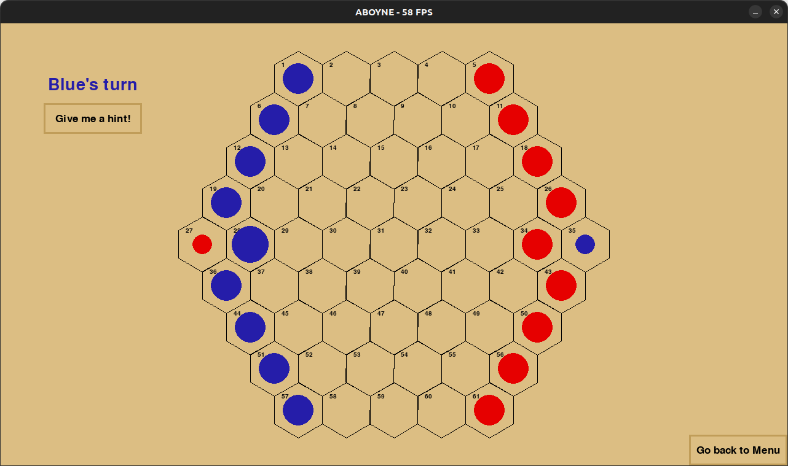
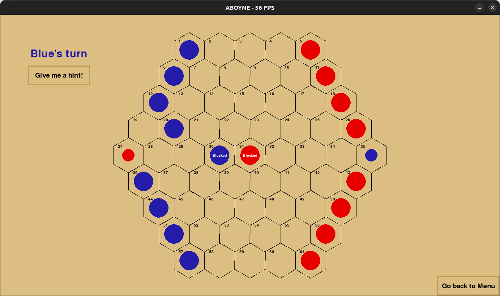
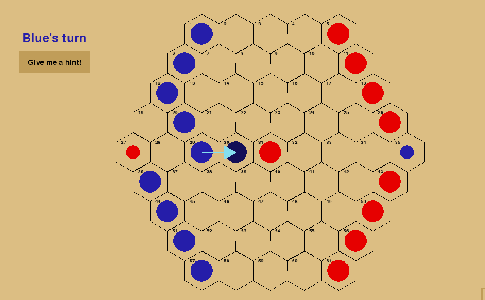
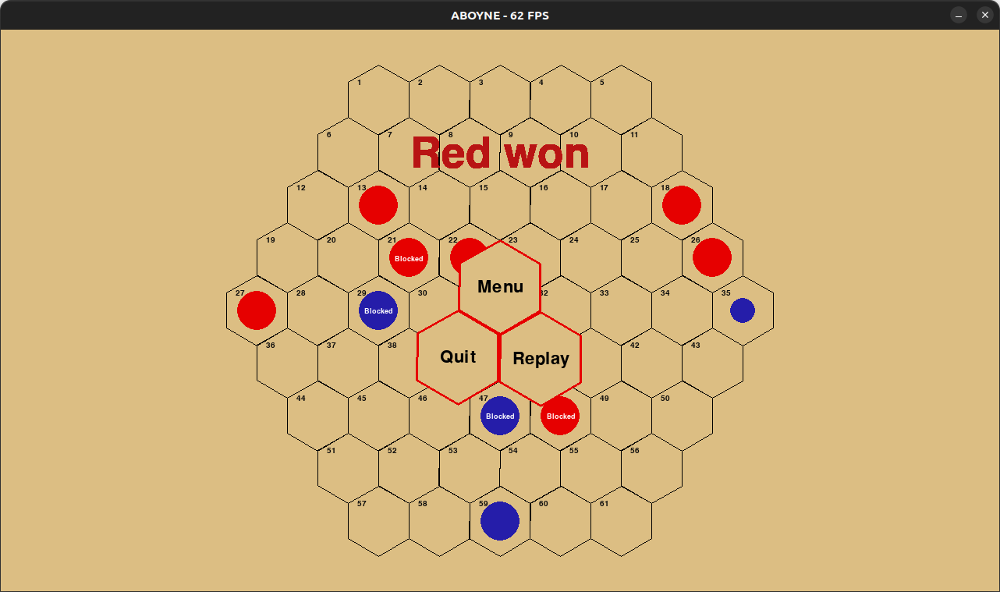

# Aboyne

## Prerequisites

In order to run this project, you will need to have Pythion 3 installed on your machine. 
Also, you will need to have pygame installed. You can install it using the following command:

```bash
$ pip install pygame
```

## Usage

To run the project, you can use the following command:

```bash
$ python3 src/main.py
```

After running the command, the game will start and you can play it by chosing Play from the main menu, and choosing the mode you want to play in and, if it is the case, the difficulty level:

 

The game will start and you can move the pieces by clicking on them and then clicking on the hexagon you want to move them to, you will notice that the piece that you selected will be highlighted, becoming a little bit bigger:



When a piece is blocked by another piece, being adjacent to other color piece, you can't move it, and the piece will be showned like this:



Also, if you need a hint, you can click on the hint button and the game will show you the next best move:




Now you can play and try to win the game by getting to the goal cell on the other side of the board.




## Authors

This project was developed by:

- Guilherme Coutinho (up202108872)
- Xavier Outeiro (up202108895)
- Miguel Figueiredo (up201706105)
